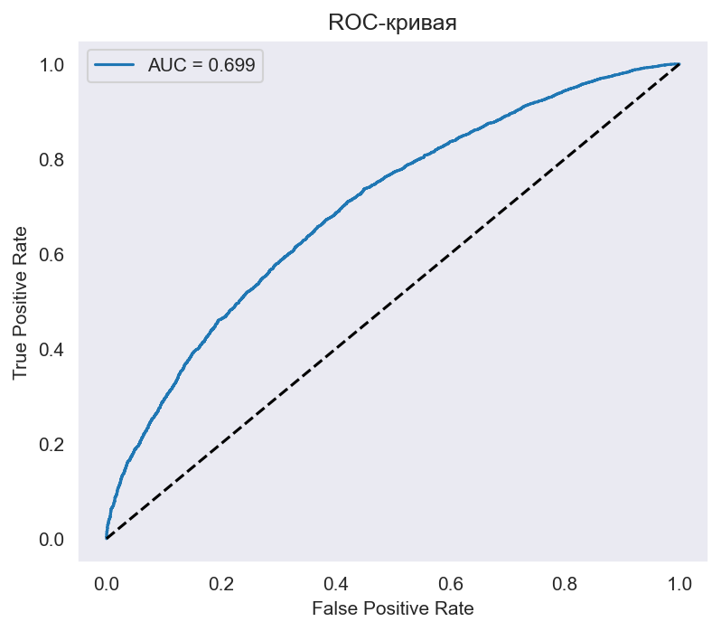
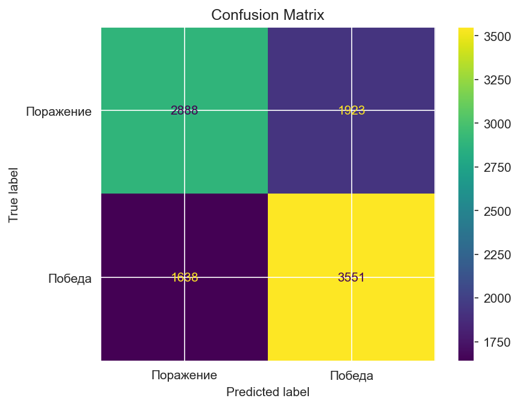
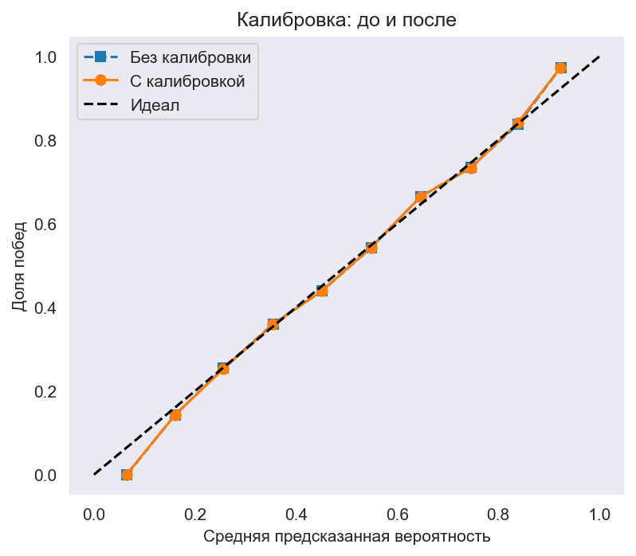

# Анализ профессиональных матчей Dota 2: что реально влияет на победу в первые 10 минут?

**Кейс для портфолио**  
*Цель: найти независимые предикторы победы без утечек данных (lookahead bias).*

## Данные и методология

- 50 000 профессиональных матчей (2016–2026)
- Все признаки считаются строго до 10-й минуты
- Для проверки независимости факторов фиксировалось равное золото (`gold_diff_10` от -500 до +500)

## Ключевые выводы

1. Золото (активное золото, gold_other)
Фактор: gold_other (активное золото: убийства, башни, руны).
Условие: равное общее золото на 10 минуте (gold_diff_10 в диапазоне -500…+500).
Результат: команда с gold_other > 0 побеждает в 53.6% против 50.7% у команды с gold_other < 0. Разница = +2.9%.
Применение: фокус на активных действиях в первые 10 минут (руны, пуши, убийства) повышает шанс на победу.

2. Чат (токсичность)
Фактор: разница в количестве токсичных сообщений (toxic_diff).
Условие: равное общее золото на 10 минуте.
Результат: статистически значимого эффекта не обнаружено (p=0.14, 95% CI пересекает 0). Разница между «Radiant токсичнее» и «Dire токсичнее» = 3.9%, но она не преодолевает порог случайности.
Применение: чат не является надёжным ранним предиктором; использовать для пост-матчевого анализа тильта, но не для прогноза.

3. XP (темп роста опыта, xp_growth)
Фактор: xp_growth (разница опыта между 5 и 10 минутами, делённая на 5).
Условие: равное общее золото на 10 минуте.
Результат: команда с xp_growth > 0 побеждает в 54.1% против 50.1% у команды с xp_growth < 0. Разница = +4.0% (p=0.0002, 95% CI [1.9%, 6.0%]) — самый сильный независимый фактор.
Применение: контроль опыта (пулы, руна опыта на 7 минуте, участие в убийствах) важнее контроля фарма.

| Фактор | Влияние на победу (positive - negative) | p-value | 95% CI |
|--------|-------------------------------------------|---------|--------|
| Темп роста опыта (`xp_growth`) | **+4.0%** | 0.0002 | [1.9%, 6.0%] |
| Активное золото (`gold_other`) | **+2.9%** | 0.007 | [0.9%, 5.1%] |
| Темп роста золота (`gold_growth`) | **+2.8%** | 0.008 | [0.7%, 4.8%] |
| Разница башен (`tower_diff`) | **–7.1%** (аномалия) | 0.010 | [-12.6%, –2.0%] |
| Рошан до 10 мин (`roshan_diff`) | не значим | 0.097 | [-0.7%, 32.4%] |
| Темп ластхитов (`lh_growth`) | не значим | 0.803 | — |

**Неожиданный результат:** при равном золоте команда, снёсшая больше башен к 10 минуте, проигрывает чаще. Возможная причина – жертва фармом ради раннего пуша.

## Модель и её качество

Логистическая регрессия на трёх значимых факторах (`xp_growth`, `gold_other`, `gold_growth`).

*ROC-AUC = 0.68 — модель более-менее разделяет классы.*

*Матрица ошибок: модель чаще ошибается в пограничных ситуациях.*

| Метрика | Значение |
|---------|----------|
| Accuracy | 0.64 |
| Precision | 0.65 |
| Recall | 0.68 |
| F1-score | 0.67 |

## Калибровка вероятностей

После калибровки модель выдаёт более честные вероятности (кривая стала ближе к диагонали).

## Ограничения

- Точность 64% – это потолок для раннего прогноза в про-матчах (команды равны по силе).
- Аномалия с башнями требует дальнейшего исследования.
- Нет данных по пикам героев и таймингам предметов (можно улучшить).

## Как использовать

- Тренерам: делать упор на темп роста опыта и активное золото (а не просто фарм).
- Аналитикам: эти признаки можно добавить в скоринговые модели.
- Для себя: я научился бороться с lookahead bias и проверять причинность.

## Ссылки

- [Ноутбук с кодом (nbviewer)]((https://nbviewer.org/github/f1retruckthepudge-prog/dota2-win-predictor/blob/main/Dota%202%202016%20-%202026.ipynb))
- [Репозиторий на GitHub]((https://github.com/f1retruckthepudge-prog/dota2-win-predictor))
